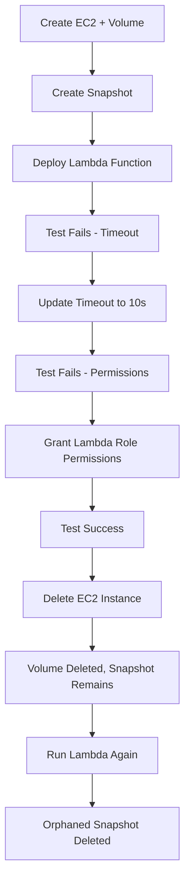

# AWS Cost Optimization - EBS Snapshot Management

## 🎯 What is AWS Cost Optimization?

AWS Cost Optimization is the practice of **reducing unnecessary expenses** while maintaining performance and reliability. One major cost driver is **orphaned EBS snapshots** - backups of deleted volumes that continue accumulating charges.

## 📊 Code Overview

This Lambda function automatically **identifies and deletes orphaned EBS snapshots**:
- ✅ Scans all EBS snapshots in your account
- ✅ Checks if snapshots belong to active EC2 instances  
- ✅ Deletes snapshots from deleted/detached volumes
- ✅ Saves costs by removing unnecessary storage

## 🔄 Workflow



## 🚀 Implementation Steps

### 1️⃣ Create EC2 Instance with EBS Volume
```bash
# Launch EC2 instance and note the Volume ID
aws ec2 run-instances --image-id ami-12345 --instance-type t2.micro
# Create snapshot from volume
aws ec2 create-snapshot --volume-id vol-12345 --description "Test snapshot"
```

### 2️⃣ Deploy Lambda Function
- Copy code from `ec2_snapshots_volume.py`
- Create new Lambda function in AWS Console
- Paste the code and deploy
- **First test will FAIL** ❌ (timeout issue)

### 3️⃣ Fix Timeout Configuration  
- Go to **Lambda → Configuration → General**
- Change timeout from 3s to **10 seconds**
- Test again - **FAILS** ❌ (permission issue)

### 4️⃣ Grant Lambda Permissions
- Go to **Lambda → Configuration → Permissions**
- Click on the **Role name**
- **Add permissions** → Create custom policy OR use **EC2FullAccess** (for demo)

**Custom Policy (Recommended):**
```json
{
    "Version": "2012-10-17",
    "Statement": [
        {
            "Effect": "Allow",
            "Action": [
                "ec2:DescribeSnapshots",
                "ec2:DeleteSnapshot",
                "ec2:DescribeVolumes", 
                "ec2:DescribeInstances"
            ],
            "Resource": "*"
        }
    ]
}
```

### 5️⃣ Test Lambda Function
- Run test again - **SUCCESS** ✅
- Script executes perfectly and identifies active snapshots

### 6️⃣ Delete EC2 Instance
- Terminate EC2 instance
- **Volume gets deleted automatically**
- **Snapshot remains orphaned** (still charging you!)

### 7️⃣ Clean Up Orphaned Snapshots
- Run Lambda function again via **Test**
- **Orphaned snapshot gets deleted** ✅
- **Cost savings achieved!** 💰

## 💡 Key Benefits

| Before | After |
|--------|-------|
| ❌ Manual snapshot management | ✅ Automated cleanup |
| ❌ Forgotten orphaned snapshots | ✅ Cost-efficient storage |
| ❌ Growing storage costs | ✅ Optimized AWS bills |

## 🔧 Production Tips

- **Schedule**: Run Lambda on CloudWatch Events (daily/weekly)
- **Monitoring**: Add CloudWatch logs for tracking
- **Safety**: Test in non-production environment first
- **Permissions**: Use least privilege principle

---
**💸 Start saving on AWS costs today with automated snapshot management!**
